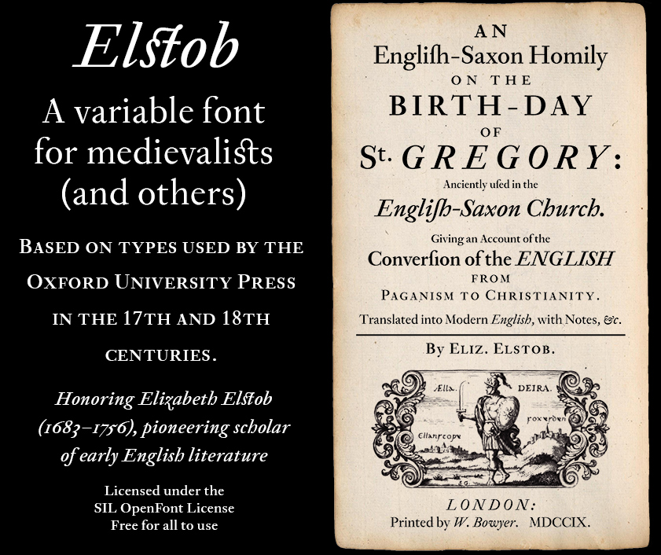
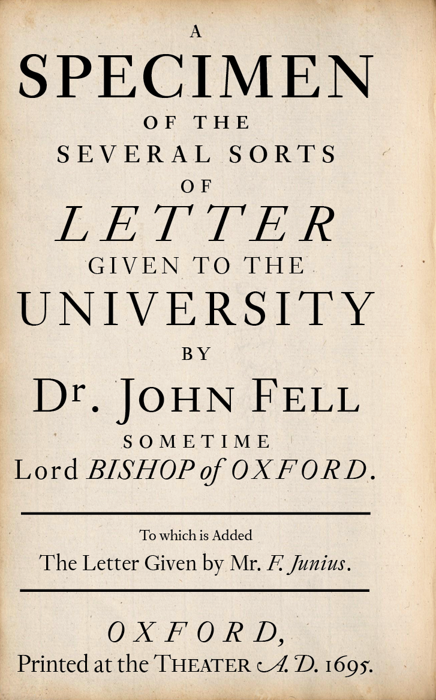

**New!** Monotonic and polytonic Greek in a new major release (version 3.0). Check it out if you're interested and post suggestions as issues.

The Elstob font (named for the eighteenth-century Anglo-Saxonist [Elizabeth Elstob](https://www.oxforddnb.com/view/10.1093/ref:odnb/9780198614128.001.0001/odnb-9780198614128-e-8761)) is based on the Double Pica commissioned by Bishop [John Fell](https://en.wikipedia.org/wiki/John_Fell_(bishop)) in the seventeenth century. Elstob is designed as a webfont. Thus:
1. It is a variable font, with weights ranging from ExtraLight to ExtraBold, optical sizes from "6pt" (for fine print) to "18pt" (for headlines) and also a grade axis (0.0–1.0). (A non-variable desktop version is also available.)
2. Outlines have been kept simple to limit file size.
4. The intention of the font is to include everything in Unicode useful to a substantial number of medievalists, but the character set has been limited to under 2000 glyphs to keep file size reasonable. Many characters from the [Medieval Unicode Font Initiative](https://skaldic.abdn.ac.uk/m.php?p=mufi), present in the designer's [Junicode](https://github.com/psb1558/Junicode-New/tree/master/legacy) font, can be represented with combining diacritics.

# Links

Visit the [specimen page](https://psb1558.github.io/Elstob-font/) to see how a variable font works and put Elstob through its paces.

~~I'll share new developments on Twitter from time to time and will welcome your feedback there.~~

# Downloading and Installing

It is strongly suggested that you avoid downloading Elstob from commercial sites,
as these do not generally offer the latest version, and some downloads may carry
viruses.

For Linux users, packages exist for Debian, Arch Linux, Parrot, and others. Check
your distribution for availability.

Windows users, Mac users, and Linux users whose distributions
do not offer Elstob should download from
[this site](https://github.com/psb1558/Elstob-font/releases/) and follow the
instructions for installing on their systems.

# Building

To build Elstob, you will need Python 3.10.4 or later. It is best to create a
[virtual environment](https://docs.python.org/3/library/venv.html) in which to
run the build script and install any Python-based dependencies in the environment.


The build script, `build_font`, is a bash script, which you can run in a Mac OS,
Linux, or other similar terminal. The script depends on several utilities
available in all such systems: `grep`, `sed` (on the Mac, install `gsed` via Homebrew),
and `xsltproc`. In addition, you will need [fontmake](https://github.com/googlefonts/fontmake)
and its dependencies (which `pip` will install automatically). If you want the variable fonts to be hinted, install
[Xgridfit 3](https://github.com/psb1558/xgridfit-3), also with pip. If you are generating
TrueType (.ttf) static fonts and want them to be hinted, install `ttfautohint`
(available in Linux repositories and via Homebrew). If you are generating CFF
(.otf) static fonts and want them to be hinted, use `pip` to install `psautohint`.
If you want to generate `woff2` webfonts, install `woff2_compress`.

To run `build_font`, open a terminal, navigate to the `source` directory, make the file executable
(`chmod +x build_font`), and run it to display the help text, `./build_font -h`,
which will tell you  how to build the various flavors of Elstob.

By default, the script builds variable fonts. To build static TrueType fonts
(the most common kind, with the suffix `.ttf`), use the `-t` option; to build
static CFF fonts (with the suffix `.otf`), use the `-o` option.

If you want to rename the font (like “ElstobD,” the desktop version of Elstob),
use the `-f` option to specify another family name. Other options control
hinting and other details of font generation.

If you are building static fonts, you may customize a couple of aspects while building.
The `-s` option controls the slant of the italic. Supply a number between 0 and
15, where 0 is steeply slanted (in fact, the slant of the original typeface)
and 15 is nearly upright. The `-p` option controls the width of the space
character. Supply a number between 0.0 and 1.0, where 0 produces a narrow space
(in the modern fashion), and 1 produces a wider space, as in old books printed
with metal type.

Once you have decided on your options, run the script once for each Glyphs
file: `Elstob.glyphs` and `Elstob-Italic.glyphs`.

Some examples. To build a variable font with Xgridfit hinting:
```
./build_font Elstob.glyphs
```
To build a reduced collection of TrueType italic static fonts with the family
name ElstobD and a relatively upright style:
```
./build_font -t -i -s 12 -f ElstobD Elstob-Italic.glyphs
```

Copyright 2020–2023 by Peter S. Baker.

This Font Software is licensed under the SIL Open Font License, Version 1.1. See the file OFL.txt or visit [http://scripts.sil.org/cms/scripts/page.php?site_id=nrsi&id=OFL](http://scripts.sil.org/cms/scripts/page.php?site_id=nrsi&id=OFL).
