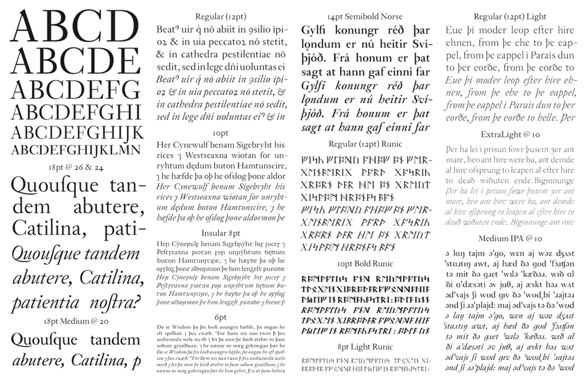

# Elstob-font


The Elstob font (named for the eighteenth-century Anglo-Saxonist [Elizabeth Elstob](https://www.oxforddnb.com/view/10.1093/ref:odnb/9780198614128.001.0001/odnb-9780198614128-e-8761)) is based on the Double Pica commissioned by Bishop [John Fell](https://en.wikipedia.org/wiki/John_Fell_(bishop)) in the seventeenth century. Elstob is designed as a webfont. Thus:
1. It is a variable font, with weights ranging from ExtraLight to ExtraBold, optical sizes from "Fine Print" (circa 6 points) to "Display" (circa 18 points or greater) and also a grade axis (1-500). (A non-variable desktop version is also available.)
2. Outlines have been kept simple to limit file size.
4. The intention of the font is to include everything in Unicode useful to a substantial number of medievalists, but the character set has been limited to around 1000 glyphs to keep file size reasonable. Many characters from the [Medieval Unicode Font Initiative](https://skaldic.abdn.ac.uk/m.php?p=mufi), present in the designer's [Junicode](https://github.com/psb1558/Junicode-New/tree/master/legacy) font, can be represented with combining diacritics.

---

---

# File Structure
```
├── [] Features and CharSet.pdf  // Character set samples
├── [] FONTLOG.txt               // Fontlog
├── fonts                        // basic proofs
|   ├── otf                      // .otf font files
|   ├── ttf                      // variable .ttf font files
|   		├── static               // .ttf font files
├── [] index.html                // Variable font sample file
├── [] OFL.txt                   // LICENCE
├── README.md                    // This file
|-- sources                      // Elstob-Font source files
├── [] Specimen.pdf              // Specimen file
├── utilities                    // Utility files
├── webfiles                     // Web fonts and demo files
├── images                       // Specimen images
```

Copyright 2020 The Elstob Project Authors (b.tarde@gmail.com)

Visit the [specimen page](https://psb1558.github.io/Elstob-font/)!

This Font Software is licensed under the SIL Open Font License, Version 1.1.
This license is copied below, and is also available with a FAQ at: [http://scripts.sil.org/cms/scripts/page.php?site_id=nrsi&id=OFL](http://scripts.sil.org/cms/scripts/page.php?site_id=nrsi&id=OFL).

